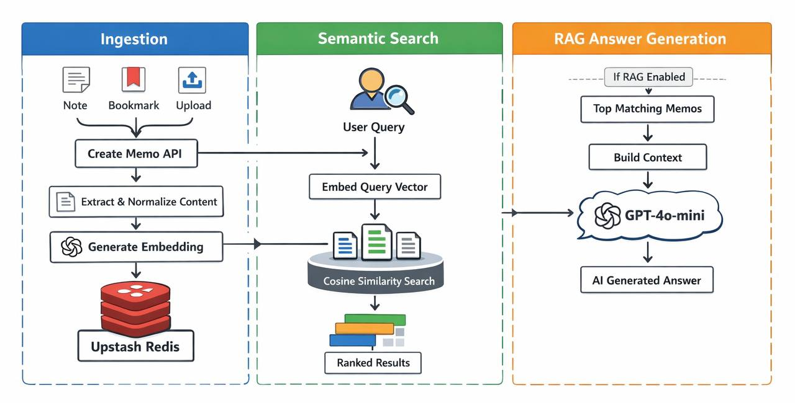

# MemoCloud

<p align="center">
  
  
  
  
</p>

Your personal knowledge base with semantic search and Retrieval-Augmented Generation (RAG). Store documents, bookmarks, and notes — then search using natural language and get AI-powered answers backed by your own knowledge.

**Live Demo:** https://memocloud.io

---

## Features

- **Multiple Input Sources** — Upload PDF/DOCX files, save bookmarks, or write direct notes
- **Smart Chunking** — Content is split into semantic chunks using LangChain's RecursiveCharacterTextSplitter for more precise search results
- **Folder Organization** — Hierarchical organization with Category → Folder → Subfolder
- **Semantic Search** — Search by meaning, not just exact keywords, using OpenAI embeddings
- **RAG Mode** — Get AI-generated answers with context from your knowledge base
- **Dark Theme** — Modern, clean dark UI

---

## Architecture



---

## Tech Stack

- **Framework:** Next.js 15 (App Router)
- **Language:** TypeScript
- **Styling:** Tailwind CSS
- **AI:** OpenAI (text-embedding-3-small, GPT-4o-mini)
- **Text Processing:** LangChain (RecursiveCharacterTextSplitter)
- **Storage:** Vercel Blob (file uploads)
- **Database:** Upstash Redis (persistent storage for memos & embeddings)
- **State:** Zustand

---

## Prerequisites

- Node.js 18+
- npm or yarn
- OpenAI API key

---

## Installation

### 1. Clone the repository

```bash
git clone https://github.com/jonas-developer/memocloud.git
cd memocloud
```

### 2. Install dependencies

```bash
npm install
```

### 3. Configure environment variables

Copy the example environment file:

```bash
cp .env.example .env.local
```

Open `.env.local` and add your keys:

```env
OPENAI_API_KEY=your_openai_api_key_here
BLOB_READ_WRITE_TOKEN=your_vercel_blob_token
UPSTASH_REDIS_REST_URL=https://your-db.upstash.io
UPSTASH_REDIS_REST_TOKEN=your_upstash_rest_token
```

- **OpenAI API key:** Get from https://platform.openai.com/api-keys
- **Vercel Blob token:** Get from Vercel dashboard → Storage → Blob →Settings → `BLOB_READ_WRITE_TOKEN`
- **Upstash Redis:** Get from https://console.upstash.com → your database → Details → REST API

### 4. Start the development server

```bash
npm run dev
```

Open [http://localhost:3000](http://localhost:3000) in your browser.

---

## Usage

### Creating a Memo

1. Click the **New Memo** button in the top right
2. Choose the type:
   - **Note** — Write directly in the app
   - **Upload** — Upload PDF, DOCX, TXT, or MD files
   - **Bookmark** — Paste a URL to save
3. Fill in the title
4. Select Category and Folder (required)
5. Optionally add a Subfolder
6. Click **Create Memo**

### Searching

1. Use the search bar at the top
2. Type your query in natural language (e.g., "what did I save about TypeScript best practices?")
3. Results show title, source URL, and timestamp
4. Enable **Use RAG (AI Answer)** to get a synthesized answer

### Navigating Folders

- Click folders in the sidebar to view memos within them
- Expand/collapse folders to see subfolders
- The view shows all memos in the selected location

---

## API Endpoints

### GET /api/memos

List all memos, optionally filtered by folder:

```
GET /api/memos?category=Work&folder=Projects
```

### POST /api/memos

Create a new memo:

```json
{
  "title": "My Note",
  "content": "Note content here",
  "source": "note",
  "category": "Work",
  "folder": "Notes"
}
```

### POST /api/search

Semantic search:

```json
{
  "query": "what did I save about TypeScript?",
  "useRag": true
}
```

Returns search results and optionally an AI-generated answer.

---

## Project Structure

```
memocloud/
├── app/                  # Next.js App Router
│   ├── api/
│   │   ├── memos/       # Memo CRUD API
│   │   └── search/      # Search + RAG API
│   ├── globals.css      # Global styles
│   ├── layout.tsx       # Root layout
│   └── page.tsx         # Main page
├── components/          # React components
│   ├── CreateMemoModal.tsx
│   ├── FolderTree.tsx
│   ├── Header.tsx
│   ├── MemoCard.tsx
│   ├── SearchBar.tsx
│   └── Sidebar.tsx
├── lib/                  # Core logic
│   ├── db.ts            # Data operations
│   ├── openai.ts       # OpenAI client
│   └── types.ts        # TypeScript types
├── stores/              # Zustand stores
├── .env.example        # Environment template
├── next.config.ts       # Next.js config
├── package.json
└── tailwind.config.ts
```

---

## Building for Production

```bash
npm run build
npm start
```

---

## Deployment

### Vercel (Recommended)

1. Push to GitHub
2. Import project in Vercel
3. Add environment variables:
   - `OPENAI_API_KEY`
   - `BLOB_READ_WRITE_TOKEN`
   - `UPSTASH_REDIS_REST_URL`
   - `UPSTASH_REDIS_REST_TOKEN`
4. Deploy

### Other Platforms

Build:
```bash
npm run build
```

Start:
```bash
npm start
```

---

## License

MIT

---

## Contributing

Contributions welcome! Open an issue or submit a PR.